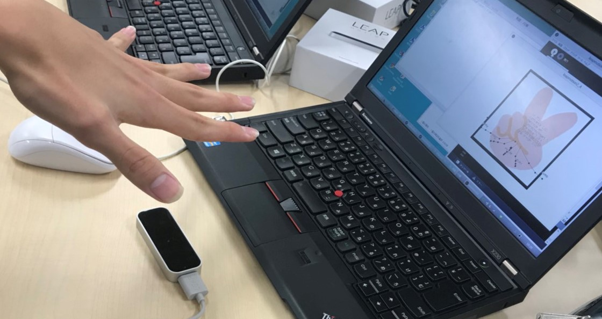
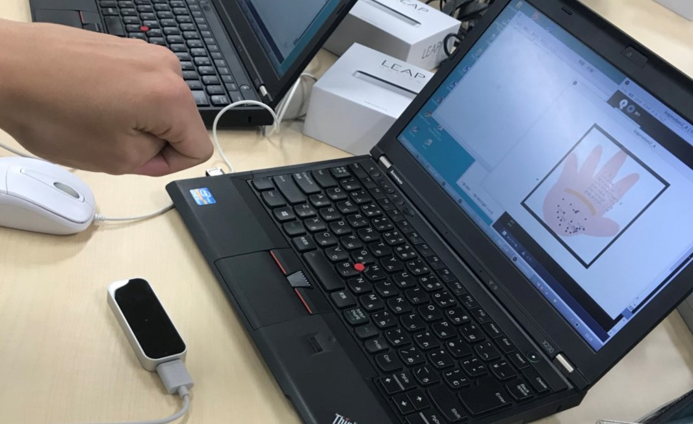
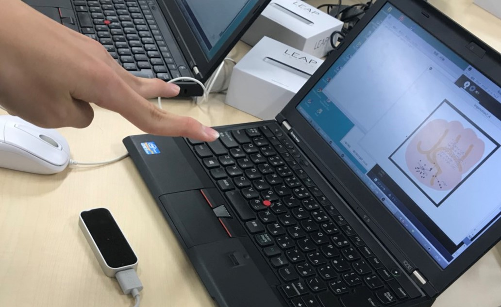

## 絶対に勝てないじゃんけんゲーム

Leap Motion センサーを活用した、出したじゃんけんの手に勝つ手を常に出し続けるプログラム。Leap Motion センサーで手のポーズを検出し、「グー」「チョキ」「パー」のじゃんけんの手を認識して、それに勝つ手を画面に表示するプログラムである。

#### 仕様

- `Processing3` を使用
- `Processing3`でLeap Motionを使用するためのライブライ`de.voidplus.leapmotion.*`をimportする必要がある
- じゃんけんの手の認識には、伸ばしたている指の本数をカウントするメソッド`size()`を使用

#### プレイ例

 

